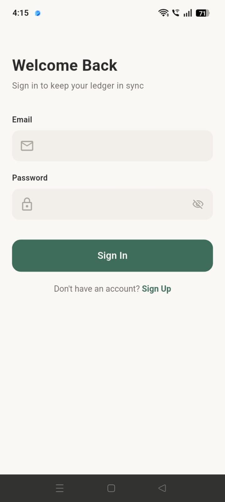
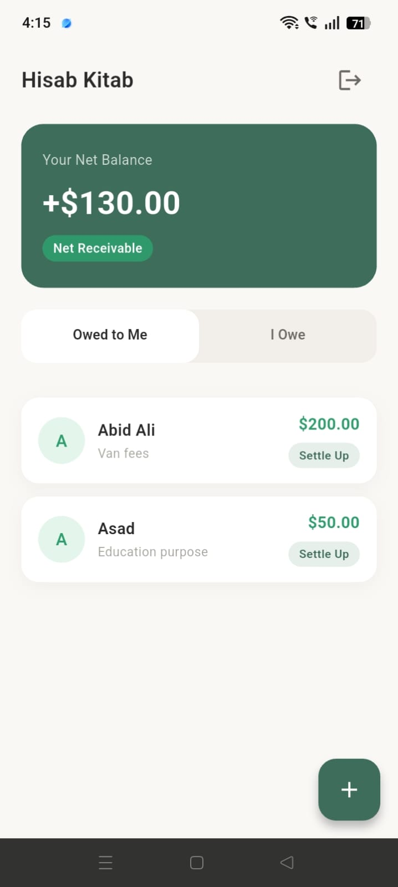
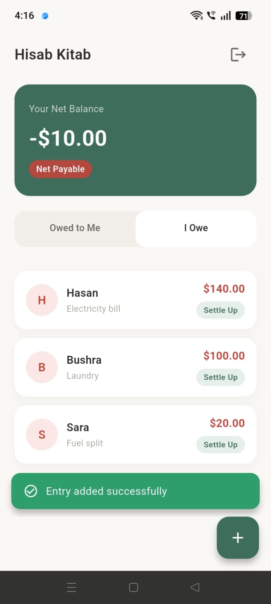
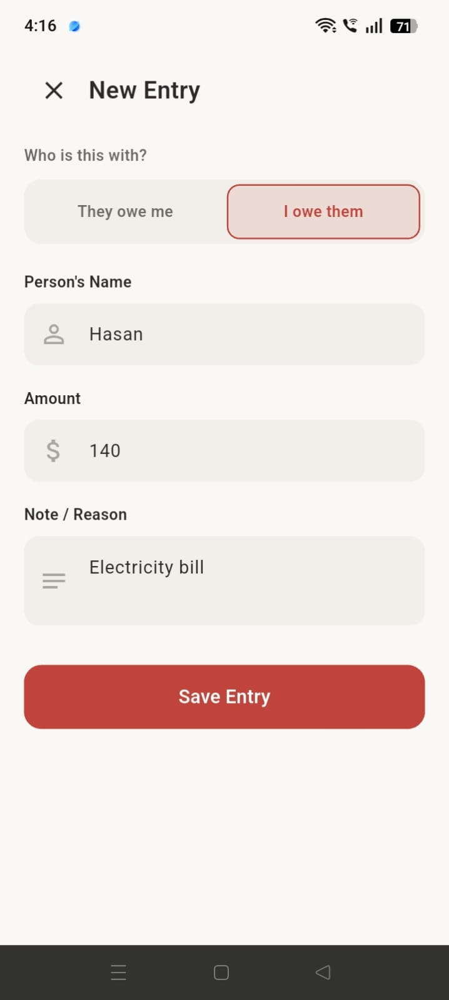

# HisabKitab 📒

**Friendship in its place, accounts in theirs.**

HisabKitab is a sleek, simple personal ledger app for tracking money borrowed from or lent to friends, family, and colleagues. It removes the awkwardness of remembering who owes what by providing a clear, transparent record for both sides — with a live, real-time synced net balance.

---

## 📱 Screenshots

| Sign In | Owed to Me | I Owe | New Entry |
|---|---|---|---|
|  |  |  |  |

---

## ✨ Features

- **Onboarding** — quick 3-slide intro to the app's core value
- **Authentication** — email/password sign-up and login via Firebase Auth
- **Dual Cash Ledger Dashboard** — a single home screen with:
    - **Net Balance Card** — instant snapshot of overall financial position
    - **"Owed to Me" tab** — money others owe you, emerald green accents
    - **"I Owe" tab** — money you owe others, warm crimson accents
- **Quick Cash Entry Logger** — log a new transaction (name, amount, note, direction) in seconds
- **One-Tap Settle Up** — mark a debt cleared and recalculate net balance in real time
- Fully **responsive UI** (scales across phone sizes via `MediaQuery`)
- Real-time sync via **Cloud Firestore** — changes reflect instantly across devices

---

## 🏗️ Architecture

This project follows **Clean Architecture**, separated into three layers per feature:

```
features/
└── <feature_name>/
    ├── domain/          # Entities, repository contracts, use cases — no framework dependencies
    ├── data/             # Models, remote data sources, repository implementations
    └── presentation/     # Screens, widgets, Providers (state management)
```

**Features implemented:**
- `auth` — sign up, sign in, sign out, current-user resolution
- `ledger_entry` — add / watch / settle / delete ledger entries
- `onboarding` — first-launch 3-slide walkthrough
- `dashboard` — main ledger view combining auth + ledger state
- `splash` — resolves auth state before routing, avoids UI flicker

**Core layer (`core/`)** holds app-wide, feature-agnostic building blocks: theming, constants, enums, extensions, reusable widgets, services, error handling, and routing.

---

## 🧰 Tech Stack

| Concern | Package / Approach |
|---|---|
| State management | `provider` |
| Navigation | `go_router` (with auth + onboarding aware redirects) |
| Dependency injection | `get_it` |
| Backend | Firebase Auth + Cloud Firestore |
| Local simple state | `shared_preferences` (onboarding-seen flag) |
| Secure storage | `flutter_secure_storage` |
| Connectivity checks | `connectivity_plus` |
| Error handling | Custom `Result<T>` / `Failure` pattern — no unhandled exceptions bubble to the UI |
| Logging | Custom `AppLogger` — structured, leveled logs across all layers |

> Note: Dio was intentionally **not used** — this app's backend needs are fully served by the Firebase SDKs directly, so a separate HTTP client would have added unnecessary complexity.

---

## 🔐 Firestore Security Rules

```js
rules_version = '2';
service cloud.firestore {
  match /databases/{database}/documents {
    match /users/{userId} {
      allow read, write: if request.auth != null && request.auth.uid == userId;
    }
    match /ledger_entries/{entryId} {
      allow read, write: if request.auth != null && request.auth.uid == resource.data.userId;
      allow create: if request.auth != null && request.auth.uid == request.resource.data.userId;
    }
  }
}
```

Every user can only read/write their own profile and their own ledger entries. A composite index on `ledger_entries` (`userId` ascending, `createdAt` descending) supports the dashboard's real-time query.

---

## 🚀 Getting Started

### Prerequisites
- Flutter SDK (stable channel)
- A Firebase project with **Authentication (Email/Password)** and **Cloud Firestore** enabled

### Setup
```bash
git clone https://github.com/SyedAsharRaza/Hisab_Kitab_App.git
cd Hisab_Kitab_App
flutter pub get
```

This repo already includes `lib/firebase_options.dart` and `android/app/google-services.json` — if you want to run it against your **own** Firebase project instead, run:
```bash
flutterfire configure
```
and follow the prompts to regenerate these files for your project.

### Run
```bash
flutter run
```

---

## 📂 Project Structure (abridged)

```
lib/
├── main.dart
├── app/
│   ├── app_name.dart
│   └── injection_container.dart
├── core/
│   ├── constants/ enums/ extensions/ router/ services/ theme/ utils/ widgets/ error/
└── features/
    ├── splash/
    ├── onboarding/
    ├── auth/
    ├── dashboard/
    └── ledger_entry/
```

---

## 📝 License

Built as part of an internship project. Free to use as a learning reference.
